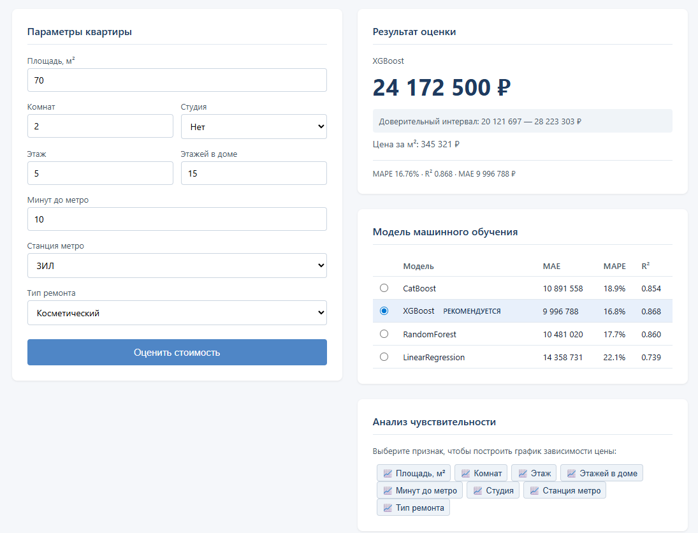
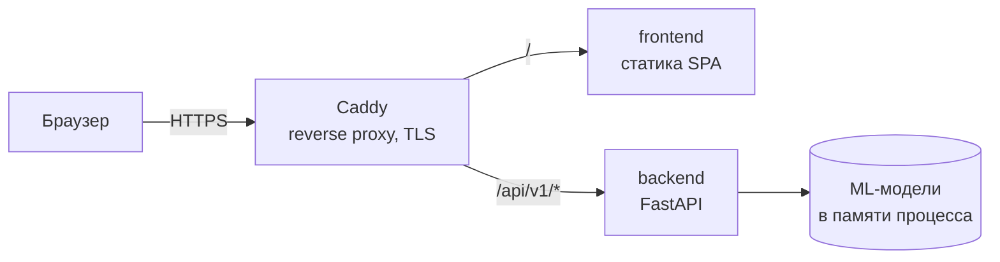

# Real Estate Valuation

Веб-сервис оценки стоимости квартир на вторичном рынке Москвы: REST API на FastAPI, SPA на React, полностью контейнеризован, разворачивается автоматически по пушу в `master`.

[](https://github.com/roman9234/real-estate-valuation/actions/workflows/ci.yml)


**Демо: [roman9234.ru](https://roman9234.ru/)**



## О проекте

Сервис оценивает рыночную стоимость квартиры по 15+ параметрам объекта — площадь, этаж, район, станция метро, тип дома, состояние ремонта и др. В отличие от массовых онлайн-калькуляторов, помимо самой цены сервис возвращает разложение оценки: вклад каждого параметра в итоговую сумму и график зависимости цены от выбранного параметра при фиксированных остальных.

Сервис не хранит состояние: базы данных нет, модели загружаются в память процесса при старте приложения через `lifespan` FastAPI и переиспользуются между запросами. Это решение продиктовано характером нагрузки — каждый запрос независим, а загрузка моделей с диска заняла бы секунды на каждый вызов.

## Стек

**Backend:** Python 3.14, FastAPI, Pydantic, pandas, pytest
**Frontend:** React, TypeScript, Recharts, React Hook Form, Axios
**Инфраструктура:** Docker, Docker Compose, Caddy, GitHub Actions, GHCR
**Модели:** CatBoost, XGBoost, Random Forest, Linear Regression (scikit-learn), SHAP

## Архитектура



Caddy — единственный контейнер, открытый наружу: он терминирует TLS (сертификат Let's Encrypt выпускается и продлевается автоматически), отдаёт статику SPA и проксирует `/api/v1/*` на backend. Backend и frontend портов на хост не публикуют и доступны только внутри сети Compose.

Backend разделён на три слоя: `routes` (валидация и HTTP), `services` (бизнес-логика), `models` (обёртки над моделями). Все обёртки реализуют общий абстрактный интерфейс `BaseMLModel`, поэтому добавление новой модели не требует изменений в слое роутов — достаточно зарегистрировать новую реализацию.

## API

Полная интерактивная документация скрыта.

| Метод | Путь | Назначение |
|-------|------|------------|
| `POST` | `/api/v1/predict` | Оценка стоимости, возвращает цену и доверительный интервал |
| `POST` | `/api/v1/explain` | Разложение оценки: вклад каждого параметра в рублях |
| `POST` | `/api/v1/sensitivity` | Зависимость цены от выбранного параметра в заданном диапазоне |
| `GET` | `/api/v1/models` | Список доступных моделей и их метрики качества |
| `GET` | `/api/v1/features` | Описание входных параметров: типы, допустимые значения, диапазоны |
| `GET` | `/api/v1/health` | Проверка состояния сервиса (используется в healthcheck контейнера) |

Все входные данные валидируются Pydantic-схемами; некорректный запрос возвращает `422` с указанием проблемного поля.

## Запуск

Требуется Docker с плагином Compose.

```bash
git clone https://github.com/roman9234/real-estate-valuation.git
cd real-estate-valuation
docker compose up --build -d
```

После сборки:

- интерфейс — http://localhost
- Swagger UI — http://localhost:8000/docs

Остановка: `docker compose down`.

## Тесты

```bash
cd backend
pip install -r requirements-dev.txt
pytest -v
```

Тесты покрывают все эндпоинты API: корректные сценарии, валидацию входных данных и граничные значения параметров. <!-- ЗАМЕНИТЬ: N тестов, покрытие X% -->

## CI/CD

Пайплайн описан в [`.github/workflows/ci.yml`](.github/workflows/ci.yml) и состоит из трёх последовательных стадий.

**test** — установка зависимостей с кэшированием pip, прогон `pytest`, публикация отчёта в формате JUnit в интерфейс GitHub Checks.

**build** — параллельная сборка образов `backend` и `frontend` через матрицу стратегии, с кэшированием слоёв в GitHub Actions Cache. На pull request выполняется только сборка (проверка корректности Dockerfile), на push в `master` образы публикуются в GHCR с двумя тегами: `latest` и хеш коммита.

**deploy** — запускается только на push в `master`. На сервер копируются `docker-compose.prod.yml`, `Caddyfile` и сгенерированный `.env`, после чего по SSH выполняется `docker compose pull && up -d`. Продакшен-конфигурация не собирает образы, а забирает готовые из реестра по тегу конкретного коммита, поэтому развёрнутая версия однозначно соответствует состоянию репозитория, а откат выполняется сменой значения `IMAGE_TAG`.

Backend в проде объявляет healthcheck, а frontend поднимается только после того, как backend перешёл в состояние `healthy`. Доступы к серверу и реестру хранятся в GitHub Secrets и на диск в открытом виде не попадают.

## Структура репозитория

```
backend/    FastAPI-приложение, ML-модели, тесты, Dockerfile
frontend/   React + TypeScript, Dockerfile
.github/    workflow CI/CD
docker-compose.yml       локальная сборка из исходников
docker-compose.prod.yml  продакшен: образы из GHCR + Caddy
Caddyfile   конфигурация reverse proxy
```
